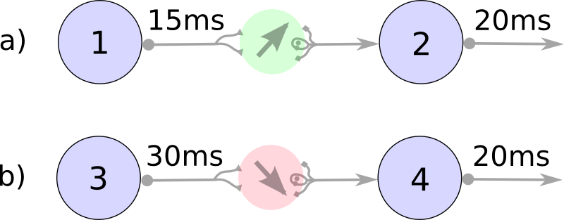

Tutorial: Learning the weights
==============================

In this tutorial the weights of our neuron network gets changed based on the STDP.

The idea of the STDP model is:

 a) if a spike arrives at a synapse, and shortly after the post-synaptic neuron fires, then the weight goes up
 b) if a spike arrives at a synapse, but the post-synaptic neuron has fired shortly before, then the weight goes down

This images visualizes this concept:

Importing the needed libraries
------------------------------

First thing we have to do is to import all the libraries we need:

.. code-block:: python

    import numpy as np
    from neurons import learning

Setting up the STDP model
-------------------------

Now we have to set up the STDP model.

.. code-block:: python

    stdp_model = learning.STDP(eta=0.05, w_in=0.5, w_out=0.5, tau=10.0, window_size=5)

This tells our STDP model all the needed parameters:

 - the learning rate eta (:math:`\eta`)
 - the change rate for incoming and outgoing spikes :math:`w_{in}` and :math:`w_{out}`.
 - tau (:math:`tau`) is a parameter for the learning window
 - `window_size` tells us to look only at the last 5ms for calculating weight changes

Or if you are already familiar with the STDP equations;

Weight change:

Learning window:

Setting up the spiketrain and initial weights
---------------------------------------------

For the weights, we use the same as in the last tutorial. As for the spiketrain, we use the resulting spiketrain
of the last tutorial:

.. code-block:: python

    weights = np.array([[0, 0, 1.],
                        [0, 0, 1.],
                        [0, 0, 0]])

    spiketrain = np.array([[0, 0, 1, 0, 0, 0, 1, 1, 0, 0],
                           [1, 0, 0, 0, 0, 0, 1, 1, 0, 0],
                           [0, 0, 0, 1, 0, 0, 0, 0, 1, 0]])

Now we are ready to go!

Calculating the weight change at all times
------------------------------------------

Similar to the last tutorial, we calculate the weight change at every timestep:

.. code-block:: python

    for time in range(10):
        stdp_model.weight_change(spiketrain, weights, time)

Look at that result
-------------------

We print the result to the console:

.. code-block:: python

    print("Weights after")
    print(weigths)

Which gives us:

::

    [[ 0.          0.          1.18586337]
     [ 0.          0.          1.17766241]
     [ 0.          0.          0.        ]]

As we can see, both weights did go up.

Exercise
--------

What do you think happens when we use the following spiketrain?

.. code-block:: python

    spiketrain = np.array([[0, 0, 1, 0, 0, 0, 0, 0, 1, 1],
                           [1, 0, 0, 0, 1, 1, 0, 0, 0, 0],
                           [0, 1, 0, 0, 0, 0, 0, 1, 0, 0]])

Do the weights:

 - both go up
 - 1 -> 3 goes up, while 2 -> 3 goes down
 - 1 -> 3 goes down, while 2 -> 3 goes up
 - both go down

*Go and try it out yourself!*

Conclusion
----------

As you see, calculating the weight changes by STDP was really easy.

In the next tutorial, we see how we can :doc:`combine both the SRM spiking and the STDP learning <spike_and_learn>`.

Sourcecode
----------

The complete source code is as follows:

.. code-block:: python

    import numpy as np
    from neurons import learning

    stdp_model = learning.STDP(eta=0.05, w_in=0.5, w_out=0.5, tau=10.0, window_size=5)

    weights = np.array([[0, 0, 1.], [0, 0, 1.], [0, 0, 0]])

    spiketrain = np.array([[0, 0, 1, 0, 0, 0, 1, 1, 0, 0],
                           [1, 0, 0, 0, 0, 0, 1, 1, 0, 0],
                           [0, 0, 0, 1, 0, 0, 0, 0, 1, 0]])

    for time in range(10):
        stdp_model.weight_change(spiketrain, weights, time)

    print("Weights after")
    print(weights)

Questions
---------

Q: Do I have to check weight changes at every timestep?

A: Yes, I absolutely advise you to do so. One reason is that if you skip a few timesteps in between, then you'll also
lose the :math:`w_{in}` and :math:`w_{out}` terms of incoming and outgoing spikes at those times.