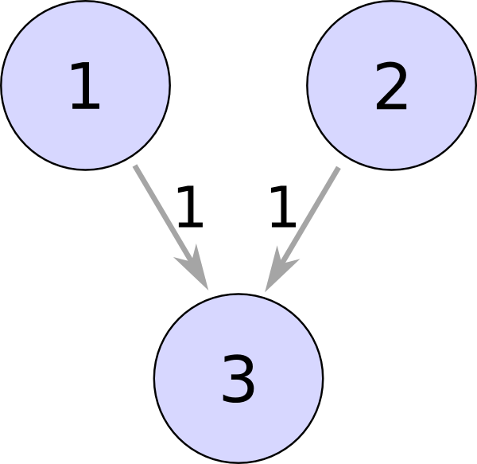

Tutorial: Your first SRM network
================================

In this first tutorial we let three SRM neurons spike.

There are two input neurons with predefined spikes, and they will excite one output neuron.

What do neurons do?
-------------------

Simply said, neurons send out short peaks of current, called *spikes*, and collect spikes from other neurons.

A neuron sends out spikes on it's *axon* and it collects the spikes from other neurons using it's many *dendrites*.
The axon is connected to the dendrites by a *synapse*, which transmits the spike chemically. Not every synapse transmits
the spike equally good (depending on many factors), some strengthen . We will call this effect the *weight* of a synapse.

Later we will see that neural networks can *learn*. This is mainly because of the different synaptic weights!

Importing the needed libraries
------------------------------

First thing we have to do is to import all the libraries we need:

.. code-block:: python

    import numpy as np
    from neurons import spiking

Setting up the SRM model
------------------------

The SRM (Spike-response model) is a model for neurons. New spikes are generated if the incoming current leads the membrane potential to exceed a certain threshold.

.. code-block:: python

    model = spiking.SRM(neurons=3, threshold=1, t_current=0.3, t_membrane=20, eta_reset=5)

This sets up a model of *3 neurons*. A neuron generates a new spike if it exceeds the threshold of 1mV. The variables
t_current, t_membrane are time constants used in the SRM model, and eta_reset resets the membrane potential after a spike (repolarization).

.. note::
    We can say here, that the values are not 'realistic.' This is because our SRM implementation assumes a resting potential
    of 0mV! Real neurons have a resting potential of around -73mV (and a threshold of -54mV, and an action potential of 40mV).

    But this should not further disturb us, because we assume that our model linearly shifts those real values. After all,
    it makes the computations easier if we assume a resting potential of 0mV.

Inter-neural weights
--------------------

We want to connect our three neurons together like this:

Both, the first and the second neuron, are connected to the third neuron with a weight of 1.
Note that the connections are directed. Neuron 1 is connected to Neuron 3 but not vice versa!

We can express this connection in a symmetric matrix:
:math:`w = \begin{pmatrix}0 & 0 & 1 \\0 & 0 & 1 \\0 & 0 & 0\end{pmatrix}`,
where the entry :math:`w_{ij}` represents the weight that neuron *i* is connected to neuron *j*.

Therefore, we define a suitable Numpy array:

.. code-block:: python

    weights = np.array([[0, 0, 1],
                        [0, 0, 1],
                        [0, 0, 0]])

Preparing a spiketrain
----------------------

Without any initial spikes, our model wouldn't do nothing!

So let's define some spikes for our neurons:

.. code-block:: python

    spiketrain = np.array([[0, 0, 1, 0, 0, 0, 1, 1, 0, 0],
                           [1, 0, 0, 0, 0, 0, 1, 1, 0, 0],
                           [0, 0, 0, 0, 0, 0, 0, 0, 0, 0]])

This matrix means that the first neuron spikes at times of 2ms, 6ms and 7ms, and that the second neuron spikes at
times of 0ms, 6ms and 7ms.

For the third neuron,  we didn't define any spikes at all. We expect that it will spike during the simulation.

Simulate the network
--------------------

We prepared the SRM neurons, a spiketrain, and the inter-neural weights, so we are ready to simulate the net!

.. code-block:: python

    for time in range(10):
        total_potential = model.simulate(spiketrain, weights, time)

Simulate(spiketrain, weights, time) calculates the membrane potential at a time t. It checks if any spikes occurred, and accordingly changes the spiketrain array in-place.

In the for-loop we calculate the membrane potential (and if exceeding the threshold generating new spikes) for every time from 0ms -- 9ms.

Enjoy the result
----------------

We are nearly finished, now all that we want to do is to enjoy our result:

.. code-block:: python

    print("Spiketrain:")
    print(spiketrain)

Which gives us:

::

    Spiketrain:
    [[0 0 1 0 0 0 1 1 0 0]
     [1 0 0 0 0 0 1 1 0 0]
     [0 0 0 1 0 0 0 0 1 0]]

As we expected, our third neuron spiked (at times 4ms and 9ms), because it collected the spikes of the other two neurons.

Conclusion
----------

As you see it didn't take much to simulate our first SRM network: just under 10 lines of Python code.

In the next section we'll see how we can visualize our results.

Sourcecode
----------

Here you can see the whole source code for our little SRM network:

.. code-block:: python

    import numpy as np
    from neurons import spiking

    model = spiking.SRM(neurons=3, threshold=1, t_current=0.3, t_membrane=20, eta_reset=5)

    weights = np.array([[0, 0, 1], [0, 0, 1], [0, 0, 0]])

    spiketrain = np.array([[0, 0, 1, 0, 0, 0, 1, 1, 0, 0],
                           [1, 0, 0, 0, 0, 0, 1, 1, 0, 0],
                           [0, 0, 0, 0, 0, 0, 0, 0, 0, 0]])

    for time in range(10):
        total_potential = model.simulate(spiketrain, weights, time)

    print("Spiketrain:")
    print(spiketrain)

Questions
---------

Why don't we define the weights at the initialization, but at every call of spiking?