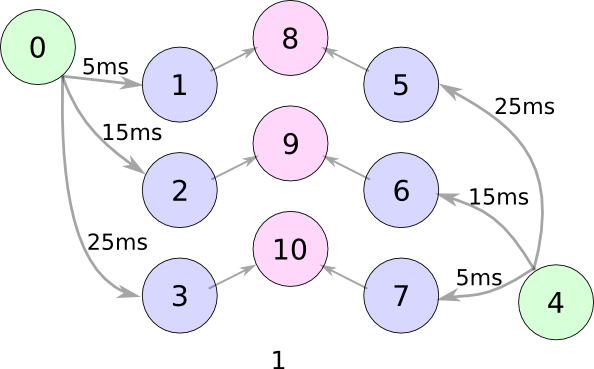

Jeffress Model
==============

In this article we want to show that it is possible to model the Jeffress Model [JEF1948]_ using an extended SRM model.

Adapting the SRM model
----------------------

In the SRM model, we can add a delay on the dendrites, by shifting the epsilon function:

# IMAGE of shifted epsilon function.

Using this we can model the following network:

Neurons 0 and 4 (green) are the input neurons. The blue neurons 1 -- 3 and 5 -- 7 are neurons with a delay on their dendrites.
The output neurons 8 -- 10 are the coincidence detectors. They spike only if their according two input neurons spike together.

.. note::
    If we shift the epsilon function, it's not anymore the original SRM model. Any properties of the original
    models might not be preserved.

    Thus, we call the adapted model *SRM_X* model from now on.

Our Example
-----------

Neuron 0 spikes at time 0ms, and neuron 4 spikes at time 20ms.

The spikes arrive at the intermediate neurons at the following times:

=========  =====  ====== ====== ====== ====== ======
  Neuron     1      2       3      5     6      7
=========  =====  ====== ====== ====== ====== ======
 Arrival    5ms    15ms   25ms   45ms   35ms   25ms
=========  =====  ====== ====== ====== ====== ======

As you can see, only neurons 3 and 7 receive a spike at the same time (25ms). This means that they are excited at the same time,
and their output will arrive at neuron 10 at the same time. Thus, neuron 10 will also spike.

In source code
--------------

Let's write our example in Python :)

First, we import all required modules.

.. code-block:: python

    import numpy as np
    import matplotlib.pyplot as plt

    from neurons import learning, spiking, plotting

Now we define how many neurons we have and how many timesteps we want to simulate:

.. code-block:: python

    neurons = 11
    timesteps = 100

In the `ax_delays` variable we define the delays in the epsilon function:

.. code-block:: python

    ax_delays = np.array([0, 5, 15, 25, 0, 25, 15, 5, 0, 0, 0])

The other variables (threshold, :math:`\tau_c, \tau_m, \eta_r`) are the same for all neurons.
Now we have everything to define the SRM_X model.

.. code-block:: python

    threshold = np.array([1]*neurons)
    t_current = np.array([5]*neurons)
    t_membrane = np.array([10]*neurons)
    eta_reset = np.array([2]*neurons)

    model = spiking.SRM_X(neurons=neurons, threshold=threshold, t_current=t_current,
                          t_membrane=t_membrane, eta_reset=eta_reset, ax_delay=ax_delays)

Let's connect the neurons together.

.. code-block:: python

    weights = np.zeros((neurons, neurons))

    # Connect input layer
    weights[0, (1, 2, 3)] = 1
    weights[4, (5, 6, 7)] = 1

    # Connect to output layer
    weights[(1, 5), 8] = 1.1
    weights[(2, 6), 9] = 1.1
    weights[(3, 7), 10] = 1.1

And set up a simple spiketrain. The spikes at neuron 4 are shifted by 20ms in comparison to neuron 1:

.. code-block:: python

    spiketrain = np.zeros((neurons, timesteps), dtype=bool)

    spiketrain[0, (0, 5, 10)] = 1
    spiketrain[4, (20, 25, 30)] = 1

It's time to simulate our model:

.. code-block:: python

    for t in range(timesteps):
        model.simulate(spiketrain, weights, t)

As always, we want to see our result, and we use a PSTH diagram for this reason:

.. code-block:: python

    psth = plotting.PSTH(spiketrain, binsize=5)
    psth.show_plot(neuron_indices=[8, 9, 10])
    plt.show()

Which gives us following plot:

.. image:: _images/jeffress_result.png
    :alt: Result of Jeffress simulation
    :width: 400px

We see that only the output neuron 10 spikes, while the other output neurons 8 and 9 remain silent.

.. note::
    Playing around with the `neuron_indices` parameter of psth.show_plot, one can discover
    the spike trains of the other neurons as well.

Extending the Network
---------------------

Of course this was only a toy example with 3 output neurons. In a future article we want to show a more complex network.

The distribution of the delays and the correct mechanism of generating a delay is still a topic of active discussions. [SP2011]

References
----------

.. [JEF1948] Jeffress L A, 1948, A place theory of sound localization," J Comp Physiol Psychol 41, 35-39.

.. [SP2011] Scholarpedia `<Jeffress Model http://www.scholarpedia.org/article/Jeffress_model>`_